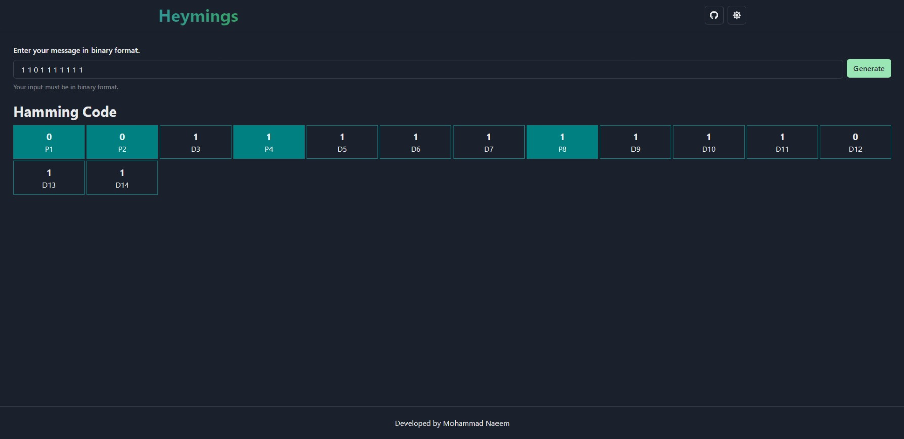

<!-- PROJECT LOGO -->
<br />
<div align="center">

<a href="https://github.com/i-naeem/heyming">

</a>
<h3 align="center">Heyming</h3>
<p align="center">
Heyming is a <strong> Hamming Code <strong> encoder and decoder which encodes given data in hamming code and decodes hamming code.
<br />

<a href="https://i-naeem.github.io/heyming">View Demo</a>
·
<a href="https://github.com/i-naeem/heyming/issues">Report Bug</a>
·
<a href="https://github.com/i-naeem/heyming/issues">Request Feature</a>
</p>

</div>

<!-- ABOUT THE PROJECT -->

## About The Project



Heyming is a hamming code encoder and decoder. It can encode data bits to hamming code. It also decodes hamming code and check for single bit errors.

### Features

- Encodes data bits to hamming code.
- Decodes hamming code.
- Detect single bit errors in hamming code.

### Built With

- [React.js](https://reactjs.org/)
- [Chakra Ui](https://chakra-ui.com/)
- [Font Awesome](https://fontawesome.com/icons)

### What I Learned ?

- Chakra Ui
- React Custom Hooks
- How Hamming Code Works

<!-- GETTING STARTED -->

## Getting Started

To run this project you would require Node v17 or above and yarn installed on your computer.

### Installation

1. Clone the repo :fire:

   ```sh
   git clone https://github.com/i-naeem/heyming.git
   ```

2. Install yarn packages :package:

   ```sh
   yarn install
   ```

3. Start the development server. :hammer:

   ```sh
   yarn start
   ```

4. Start the build. :sparkles:

    ```sh
    yarn build
    ```

<!-- ROADMAP -->

## Roadmap

- :heavy_check_mark: Add a README
- :heavy_check_mark: Add Decoder.
- :heavy_check_mark: Add dark mode.
- :heavy_check_mark: Add Meta Information.
- :black_large_square: Add left to right or right to left for decoder.

<!-- CONTRIBUTING -->

## Contributing

Contributions are what make the open source community such an amazing place to learn, inspire, and create. Any contributions you make are **greatly appreciated**.

If you have a suggestion that would make this better, please fork the repo and create a pull request. You can also simply open an issue with the tag "enhancement".
Don't forget to give the project a star! Thanks again!

1. Fork the Project
2. Create your Feature Branch (`git checkout -b feature/AmazingFeature`)
3. Commit your Changes (`git commit -m 'Add some AmazingFeature'`)
4. Push to the Branch (`git push origin feature/AmazingFeature`)
5. Open a Pull Request

<!-- LICENSE -->

## License

Distributed under the MIT License.

<!-- CONTACT -->

## Contact

Mohammad Naeem - [@nemoxhan](https://twitter.com/nemoxhan)

Project Link: [https://github.com/i-naeem/heyming](https://github.com/i-naeem/heyming)
